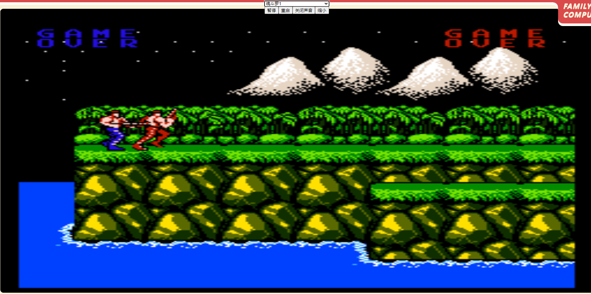

# FCGameJoy
A FC game(NintendoNes) monitor on PC Web, you can only play via  joystick.  
80 and 90 boys and girls will play FC/NintendoNes games on TV via joystick with their friends.  
FC游戏（也叫红白机、任天堂游戏、小霸王游戏）是80/90年代的人年轻的时候经常玩的游戏。  
经典的游戏有马里奥、魂斗罗等。都是满满的回忆。

# url
可以玩的网址Url: 

# Introduction改进
* 去掉了界面按键，只能通过游戏手柄玩 Only Play via JoySticks
* 游戏在大屏幕上显示，如电脑显示器、电视机。 play on PC Screen or TV
* 大屏幕+物理按键 才是当初的游戏玩法
* 优化了手柄按键的长按和连发。new function AA or BB press,and long pressed.
* 支持两个游戏玩家 two players at the same time

# Screen Capture截图

# Reference参考
* https://gitee.com/feiyu22/jsnes
* https://github.com/bfirsh/jsnes

# Supporter
* Triweb.cn
* 459755483@qq.com

